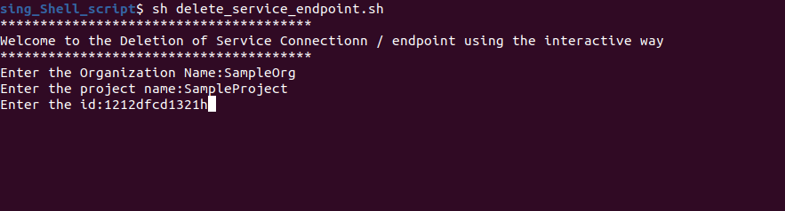
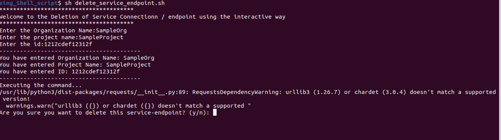

## Description

Here, In this template, we will delete any service connection of the Azure DevOps (ADO) using the shell script by login through azure devops only. 

---

#### Pre-requisite

* AZ Account
* Azure CLI
* Azure DevOps login

---

### Steps:-
1. Login into AZ account using `az login` or `az login --tenant <TENANT-ID>`
2. Login into the Azure DevOps using `az devops login` and use your Personal Access Token (PAT)
3. You can also check your ADO Details using `az devops project list`
1. Change the permission of the file `chmod a+x delete_service_endpoint.sh`
1. Go to the terminal and run the command `./delete_service_endpoint.sh`

---

### Outputs
Here, In this output it's showing the inputs taken for process of the Service Connection deletion:

Here, In this output it's showing all the inputs which is taken:

Here, In this output it's changing the state of VM:

Here, In this output it is displaying thr successful execution of the command

Here, In this output it is asking for the option for the continuation to delet another service connection

---